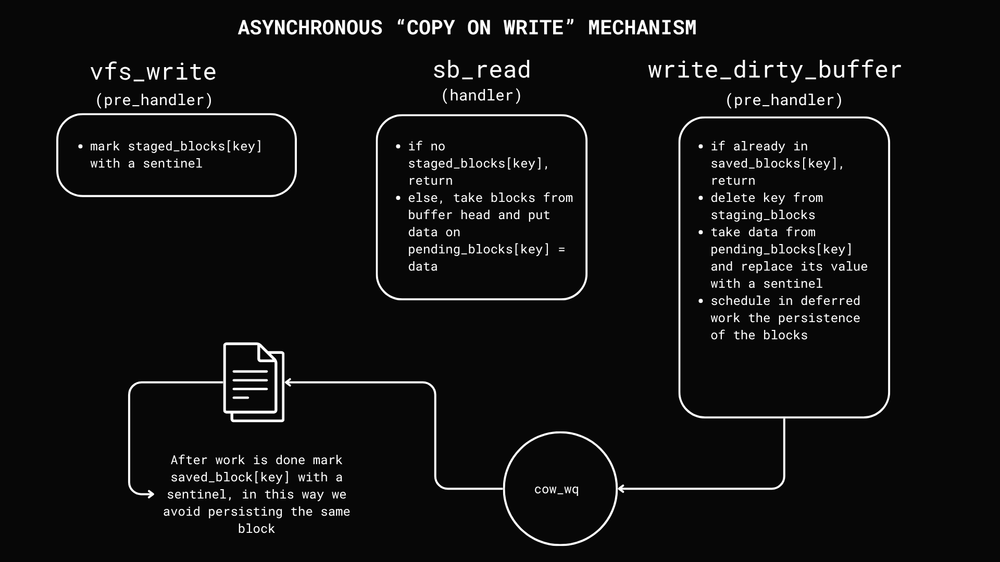

# block-device-snapshot

This project implements a Linux Kernel Module (LKM) that provides a snapshot service for block devices hosting file systems. It intercepts both block-level write  and buffer cache operation, saves the original data of any modified block, and allows for the restoration of the device to its pre-mount state.

The service is controlled via custom system calls:

    activate_snapshot(char * dev_name, char * passwd)
    deactivate_snapshot(char * dev_name, char * passwd) 


## Architecture

The system consists of :

1.  **Main Kernel Module (`block-device-snapshot.c`)**: The entry point that initializes all subsystems, installs the custom system calls, and manages module parameters.
2.  **Registration & Mount Hooks (`register/`)**: Manages the list of devices designated for snapshotting. It uses kprobes to detect when a registered device is mounted or unmounted to trigger session management.
3.  **Snapshot Engine (`snapshot/`)**: The core of the COW mechanism. It manages snapshot sessions, creates the on-disk snapshot structure, and uses workqueues to asynchronously read old block data and write it to the snapshot store.
5.  **User-space CLI (`user/user.c`)**: A simple program that invokes the custom system calls to `activate` or `deactivate` the snapshot service for a given device.
6.  **Restore Utility (`restore/restore.c`)**: A command-line tool that reads the snapshot data and allows a user to interactively select a session to restore, overwriting the block device with the saved pre-images.

## Some Details about implementation

This module implements two alternative mechanisms for Copy-on-Write (CoW) snapshots:
1. **Buffer-cache hooking for SingleFileFS support.**    
   - `vfs_write` marks candidate blocks in `staged_blocks`.
   - `_ _bread_gfp` copies the *old data* into `pending_block` when a staged key is seen and nothing is saved yet.
   - `write_dirty_buffer` confirms the write: it swaps the `pending_block` entry with a sentinel and enqueues persistence work.
   - If the snapshot files are ready, a worker (`cow_mem_worker`) writes `blocks.dat` + `blocks.map`, marks `saved_blocks[key]=1`, and clears `pending_block[key]`.

   

2. **Vfs_write hooking + synchronous BIO read for modern FS like EXT4.**  
   For filesystems that no longer use the buffer cache, we only hook `vfs_write` and perform synchronous reads of the old blocks with `submit_bio_wait`:
   - `vfs_write` computes the affected logical blocks, and for each block:
     - if not in `saved_blocks`/`pending_block`, we read the old contents via `submit_bio_wait` and place the copy into `pending_block`.
   - If the snapshot files are ready, we enqueue the worker to persist data as above (`cow_mem_worker`).

### Snapshot Directory Structure
When a snapshot session is active, data is stored in the `/snapshot` directory on the root filesystem. Each session creates a unique subdirectory with the timestamp at mount event.

```
/snapshot/
└── <dev_name>_<timestamp>/
    ├── blocks.dat        # Raw data blocks, appended sequentially.
    ├── blocks.map        # Index file with records of {sector, size, offset_in_dat}.
    └── meta.json         # Metadata about the session (device, fs type, block count).
```

## Getting Started

### Prerequisites

*   Linux Kernel Headers (e.g., `linux-headers-$(uname -r)`)
*   `make`, `gcc`, `build-essential`
*    Tested On Linux kernel: 6.11.0-21-generic

### Configuration

1.  **Set the Secret**: The module authenticates control commands using a secret password. Create a file named `s3cr3t` in the repository root.

    ```bash
    echo "your-secret-password-here" > s3cr3t
    ```
2. Before building the main module, include the_usctm in this folder:
    ```bash
    git clone https://github.com/FrancescoQuaglia/Linux-sys_call_table-discoverer.git
    ```
    This is responsible for finding unused entries in the system call table at runtime, allowing the main module to insert its custom system calls.

### Build

Compile the kernel module and load all modules using the script sh:

```bash
./install.sh
```
If you want to test bio layer hooking just set **use_bio_layer=1** in the Makefile.

This command will:
*   Compile the `the_usctm` module.
*   Compile the main `block-device-snapshot.ko` module.
*   Compile the `user` and `restore` command-line tools.

### Usage

The following steps demonstrate a typical workflow using a loop device.

1.  **Create a Test Device**: Create a 100MB file-backed block device with:

    ```bash
    make create-singlefilefs
    ```

2.  **Activate Snapshotting**: Before mounting, tell the module to monitor the device.

    ```bash
    ./user.out activate <devname> <password>
    ```

4.  **Mount the Block Device**: Mount the loop device. This will trigger the kprobe hook, and a new snapshot session will begin.

    ```bash
    make mount-fs
    ```

5.  **Modify Files**: Create or modify files on the mounted filesystem. Every overwritten block's original content will be saved.

    ```bash
    echo "This is a test." | sudo tee ./mount/the-file
    ```

6.  **Unmount the Device**: Unmounting stops the snapshot session and finalizes the snapshot files.

    ```bash
    sudo umount ./mount
    ```

7.  **Restore the Snapshot**:
    *   First, compile the restore utility if you haven't already.
        ```bash
        make compile-restore
        ```
    *   Run the utility, providing the path to the original device image. It will present an interactive menu of available snapshots.

        ```bash
        sudo ./restore/restore.out <devname>
        ```
    *   Follow the on-screen prompts to select a snapshot and confirm the restore operation.

8.  **Deactivate Snapshotting**: To prevent the module from creating new snapshots on future mounts of the device, run:

    ```bash
    ./user.out deactivate <devname> <password>
    ```

9.  **Cleanup**: Unload the modules and remove all build artifacts.

    ```bash
    make clean
    ```

